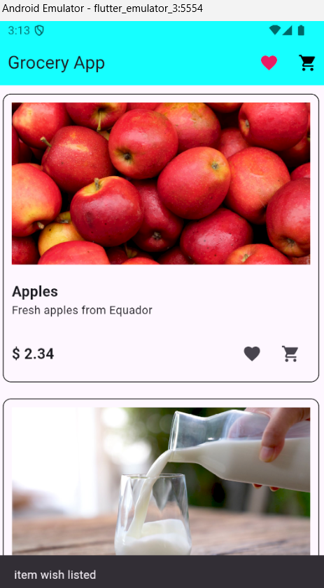
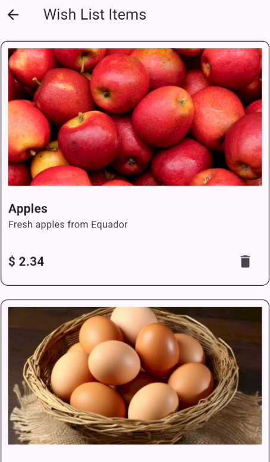
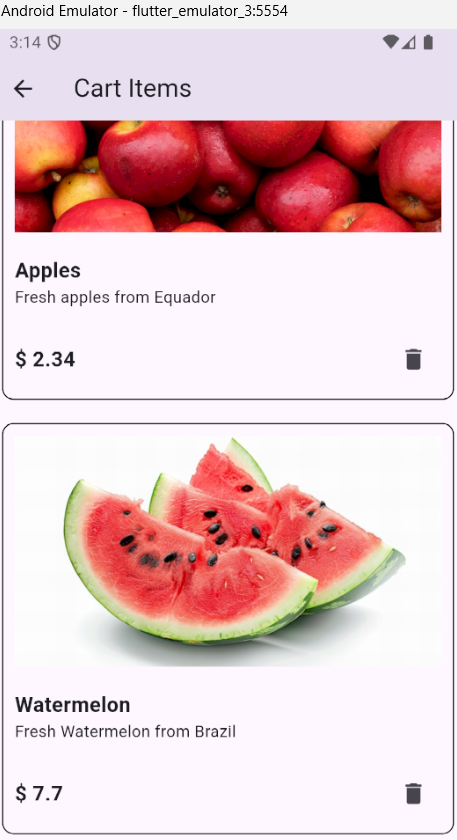

# Grocery Screen

## Images

### Home Screen

### WishList Items

### Cart Items

### Explanation About the Library Used + Link of the tutorial

Bloc:
Bloc (Business Logic Component) is a design pattern that manages state and event handling in Flutter apps. 
It separates business logic from UI, ensuring a clear flow where events trigger logic, which then emits new states. 
This promotes cleaner, more maintainable code.

Flow in the Application:
Event: User interaction triggers an event.
Bloc: The bloc receives the event, processes it, and emits a new state.
State: The UI listens to the state, and widgets rebuild based on the new state.
Listener: Optionally, side effects like navigation or showing a dialog occur based on state changes.

BlocConsumer:
BlocConsumer is a widget that combines the functionality of both BlocBuilder and BlocListener.
It rebuilds UI components in response to state changes and performs
actions (like showing a dialog) based on specific states. It's crucial for managing 
both state and side effects in one place.

BlocListener:
BlocListener is used to listen for state changes in a bloc and execute side effects like showing a dialog, 
navigating to another page, or showing a snackbar.
Unlike BlocBuilder, it doesn’t rebuild the UI; it only reacts to state changes.

Link of the Tutorial: https://www.youtube.com/watch?v=Y1roIi0-Sro

